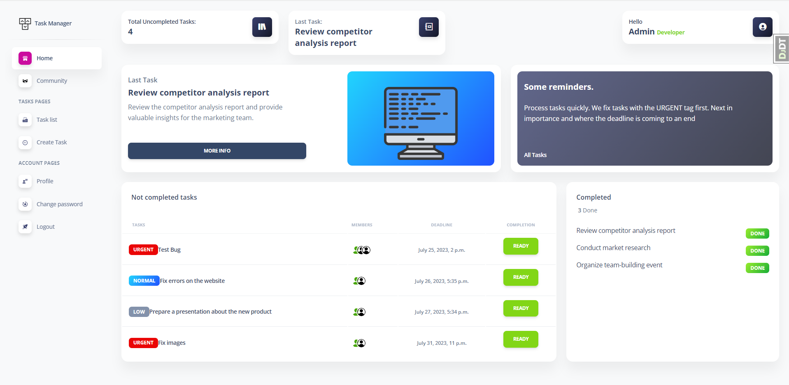
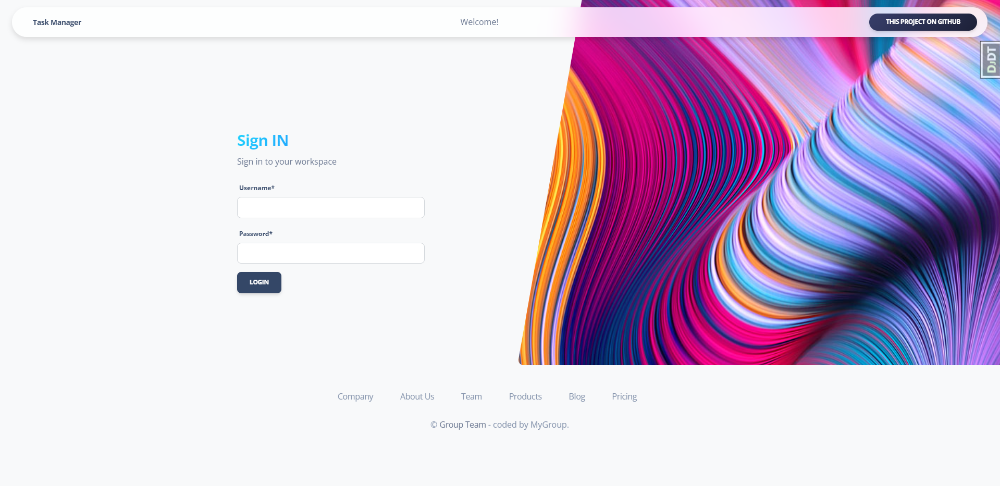

# IT Manager Task project

Django project for project management

## Check it out
[Task Manager deployed to Render](https://task-manager-sjvl.onrender.com/)


You can test:
```
login: test
password: test123456
```

## Installation

Python3 must be already installed

```shell
git clone https://github.com/bezhevets/company_task_manager.git
cd company_task_manager
python3 -m venv venv
source venv/bin/activate
pip install requirements.txt

python manage.py makemigrations
python manage.py migrate
python manage.py runserver

```

## Features

* Authentication functionality for User
* Manage tasks and workers directly from website.
* The superuser has full access. They can create positions, workers, tasks, delete workers, delete tasks, and edit the task deadline.
* An employee has partial access can create tasks, select tasks, and mark completed tasks.

## Demo


